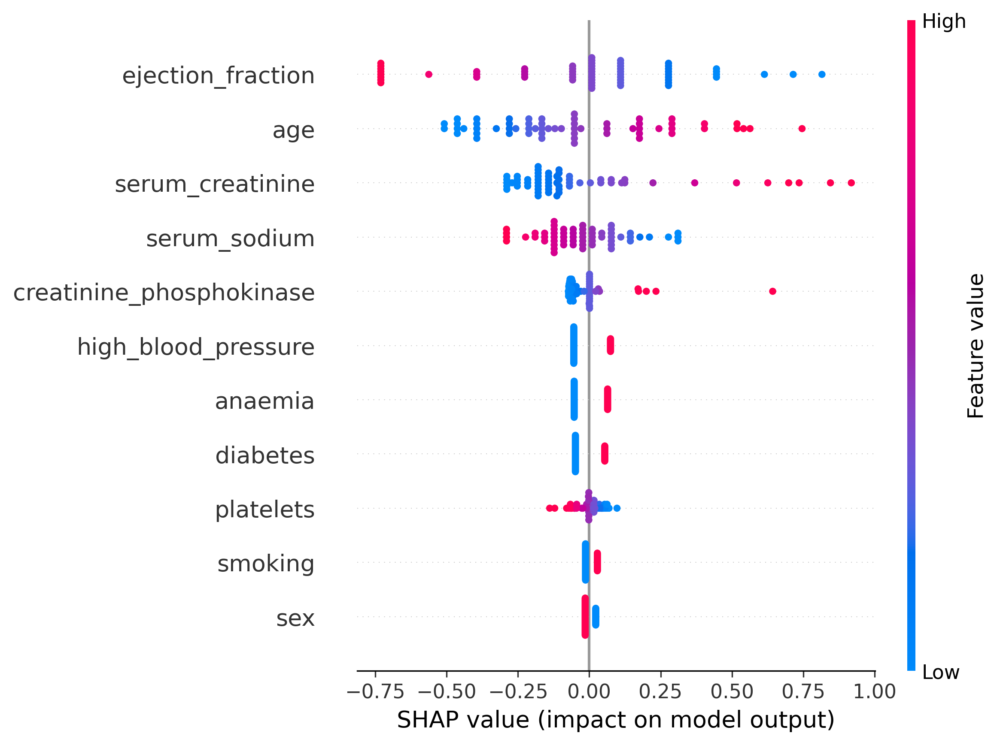
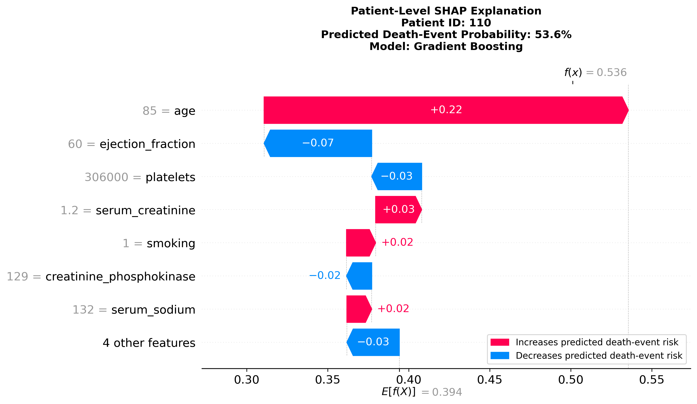
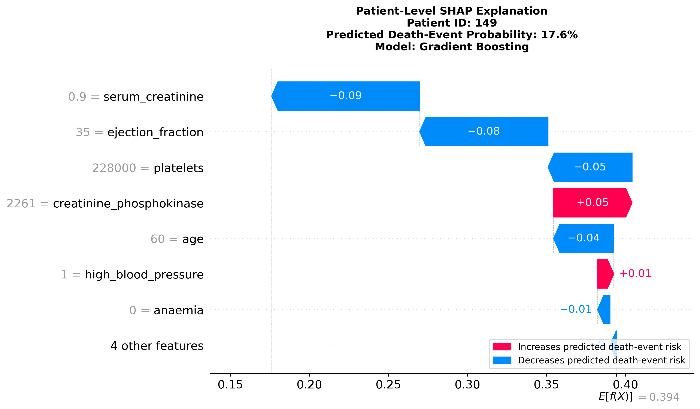
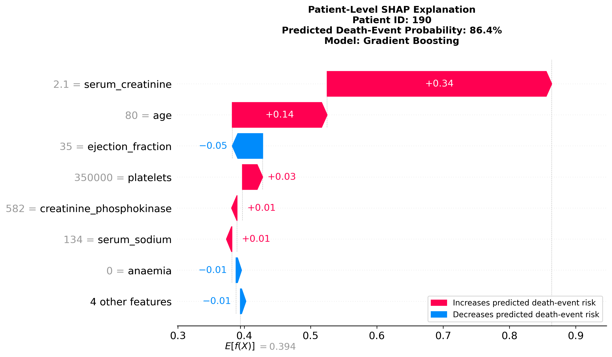

# Toward Precision Medicine: Explaining Mortality Risk Predictions in Heart Failure Patients

---

## 1. Project Overview

This project analyzes a heart failure clinical records dataset to understand mortality risk patterns among heart failure patients.

The target variable is `DEATH_EVENT`:

- `0` = no death event was observed during follow-up
- `1` = a death event was observed during follow-up

The project connects to precision medicine because patients with the same disease can have different risk profiles. These differences may depend on age, heart function, kidney function, blood chemistry, comorbidities, and lifestyle-related variables.

The goal is not only to build prediction models, but also to explain why the models made certain predictions.

---

## 2. Why This Project Matters

In healthcare, prediction alone is not enough. A model may estimate that a patient has higher risk, but clinicians and analysts also need to understand what contributed to that prediction.

This project demonstrates a responsible health data analytics workflow that combines:

- Statistical analysis to understand patient-level patterns
- Machine learning to predict death-event outcomes
- Model evaluation focused on healthcare-relevant errors
- SHAP explainability to interpret model behavior
- Patient-level explanation to connect predictions back to individual clinical profiles

This supports the broader idea of precision medicine: patients may share the same diagnosis, but their risk profiles can be different.

---

## 3. Dataset Summary

| Dataset Item | Value |
|---|---:|
| Patients | 299 |
| Variables | 13 |
| Target variable | `DEATH_EVENT` |
| No death event | 203 patients |
| Death event | 96 patients |
| Missing values | None |
| Duplicate rows | None |

Each row represents one heart failure patient. The variables include demographic information, clinical measurements, comorbidity indicators, follow-up time, and death-event outcome.

---

## 4. Project Workflow

The project followed this workflow:

1. Dataset understanding
2. Exploratory data analysis
3. Statistical testing
4. Machine learning modeling
5. Model evaluation
6. SHAP-based explainable AI
7. Patient-level interpretation
8. Limitations and future direction

An important modeling choice was to exclude the `time` variable from the classification feature set. Follow-up time is part of the survival outcome process, so including it as a regular predictor could increase leakage risk. This also motivates survival analysis as the main future direction of the project.

---

## 5. Exploratory and Statistical Analysis

The exploratory analysis included:

- Checking dataset shape
- Checking data types
- Checking missing values
- Checking duplicate rows
- Reviewing target distribution
- Exploring numerical variable distributions
- Creating boxplots
- Comparing categorical variables
- Creating crosstabs
- Reviewing correlations

The statistical analysis helped compare patient groups with and without observed death events.

Several variables showed distributional differences between the two groups:

- Patients with a death event tended to be older.
- Patients with a death event tended to have higher serum creatinine.
- Patients with a death event tended to have lower serum sodium.
- Patients with a death event tended to have lower ejection fraction.

These findings should be interpreted carefully. They show associations and distributional differences in this dataset, not proof that these variables caused death.

| Variable | Statistical Test | p-value | Simple Interpretation |
|---|---|---:|---|
| Age | Mann-Whitney U | 8.34e-05 | Death-event patients tended to be older |
| Serum creatinine | Mann-Whitney U | 7.90e-11 | Death-event patients tended to have higher serum creatinine |
| Serum sodium | Mann-Whitney U | 0.000146 | Death-event patients tended to have lower serum sodium |
| Ejection fraction | Mann-Whitney U | 3.68e-07 | Death-event patients tended to have lower ejection fraction |

---

## 6. Machine Learning Modeling

The machine learning task was framed as binary classification:

> Predict whether a patient experienced a death event during follow-up.

The classification target was `DEATH_EVENT`.

To make the modeling workflow more reliable, I used:

- Stratified train-test split
- Preprocessing pipelines
- Model tuning
- Test-set evaluation
- Predicted probabilities
- Confusion matrices
- Precision, recall, and F1-score

Because death-event patients were the minority class, I did not rely on accuracy alone. In healthcare risk prediction, accuracy can be misleading when one class is more common than the other.

---

## 7. Model Evaluation

The models were evaluated with special focus on the death-event class.

| Model | Death-event Precision | Death-event Recall | Death-event F1 | Portfolio Interpretation |
|---|---:|---:|---:|---|
| Tuned Logistic Regression | 0.61 | 0.74 | 0.67 | Best balance of interpretability and death-event detection |
| Tuned Random Forest | 0.52 | 0.63 | 0.57 | Moderate performance after tuning |
| Tuned Gradient Boosting | 0.58 | 0.74 | 0.65 | Comparable recall; useful nonlinear SHAP explanation |
| Tuned SVM | 0.46 | 0.95 | 0.62 | Very high recall, lower precision |
| Tuned KNN | 0.45 | 0.26 | 0.33 | Weak death-event detection |

### Healthcare Meaning of Model Errors

A false negative means the model predicted lower risk for a patient who actually experienced a death event.

A false positive means the model predicted higher risk for a patient who did not experience a death event.

A predicted probability is the model-estimated risk for a patient. It is not a diagnosis.

---

## 8. Explainable AI with SHAP

SHAP was used to explain how the models made predictions.

In simple terms, SHAP helps answer:

> Why did the model make this prediction?

There are two main levels of SHAP interpretation:

- **Global SHAP:** explains which features were important across many patients.
- **Patient-level SHAP:** explains why the model made a prediction for one specific patient.

For the death-event class:

- Positive SHAP values push the model toward predicting death event.
- Negative SHAP values push the model away from predicting death event.

I selected two models for SHAP interpretation:

- **Tuned Logistic Regression** as a clinically readable baseline.
- **Tuned Gradient Boosting** as a flexible nonlinear model.

| Model | Top SHAP Features |
|---|---|
| Logistic Regression | ejection_fraction, age, serum_creatinine, serum_sodium |
| Gradient Boosting | serum_creatinine, ejection_fraction, age, platelets |

The SHAP results suggest that ejection fraction, serum creatinine, and age were consistently important contributors to predicted mortality risk across the selected models.

These explanations are model-based. They describe how the trained models used patient features to make predictions. They do not prove clinical causality.

---

## 9. Patient-Level Explanations

Patient-level SHAP explanations were used to show how individual predictions were formed.

### True Positive Example

Patient 110 was correctly predicted as death event.

- Actual outcome: death event
- Predicted outcome: death event
- Predicted death-event probability: 53.6%

This example shows a patient the Gradient Boosting model correctly identified as higher risk.

### True Negative Example

Patient 149 was correctly predicted as no death event.

- Actual outcome: no death event
- Predicted outcome: no death event
- Predicted death-event probability: 17.6%

This example shows a patient the model correctly identified as lower risk.

### False Positive Example

Patient 190 was predicted as death event, but the actual outcome was no death event.

- Actual outcome: no death event
- Predicted outcome: death event
- Predicted death-event probability: 86.4%

This case is important because it shows how the model may overestimate risk for some patients.

No false negative example was found in the selected Gradient Boosting test results.

---

## 10. Figures

### Global SHAP Feature Importance

**Caption:** Logistic Regression SHAP beeswarm plot showing which features pushed predictions toward or away from the death-event class.

### True Positive Patient Explanation

**Caption:** Patient-level SHAP waterfall plot for a correctly predicted death-event patient.

### True Negative Patient Explanation

**Caption:** Patient-level SHAP waterfall plot for a correctly predicted no-death-event patient.

### False Positive Patient Explanation

**Caption:** Patient-level SHAP waterfall plot for a patient whose risk was overestimated by the model.

---

## 11. Key Takeaways

This project shows how statistical analysis, machine learning, and explainable AI can work together in a health data analytics workflow.

Key findings include:

- Death-event patients tended to be older.
- Death-event patients tended to have higher serum creatinine.
- Death-event patients tended to have lower serum sodium.
- Death-event patients tended to have lower ejection fraction.
- Tuned Logistic Regression provided the best balance of interpretability and death-event detection.
- Tuned Gradient Boosting provided useful nonlinear SHAP explanations.
- SHAP helped explain both global feature importance and individual patient predictions.
- The results should be interpreted as exploratory and educational, not clinical decision-making evidence.

---

## 12. Limitations

1. **Small dataset size:** The dataset contains only 299 patients, which limits model stability and generalizability.

2. **No external validation:** Model performance may not transfer to other hospitals, populations, or clinical settings.

3. **Observational and non-causal:** Statistical associations and SHAP explanations do not prove clinical causality.

---

## 13. Future Work

The main future direction is survival analysis.

The current machine learning classification approach predicts whether a death event occurred. Survival analysis can answer a richer question:

> How does risk change over time?

Future work will include:

- Kaplan-Meier survival curves
- Log-rank tests
- Cox proportional hazards regression
- Hazard ratio interpretation
- Proportional hazards assumption checks
- Concordance index evaluation
- Comparison between survival analysis and machine learning classification

Survival analysis is especially appropriate because the dataset includes both `time` and `DEATH_EVENT`.

---

## 14. Disclaimer

This project is for educational and analytical purposes only. The models developed here are not intended for clinical diagnosis, treatment decisions, or replacement of medical judgment. Any real-world clinical application would require external validation, clinical expert review, fairness assessment, regulatory consideration, and prospective testing.

---